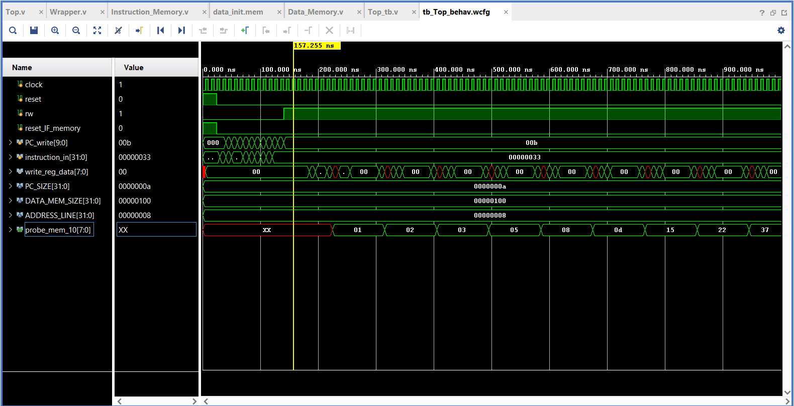

# 8-Bit Pipelined "RISC-V Like" Processor

## Overview
This project is a custom-designed 8-bit processor written in Verilog. It features a classic 5-stage pipeline (Fetch, Decode, Execute, Memory, Write-back) and is heavily inspired by the RISC-V instruction set architecture. It is designed to be lightweight, educational, and optimized for FPGA deployment using Xilinx Vivado.

## Why It Is "Similar" to RISC-V (The 8-Bit Adaptation)
While this processor borrows instruction encoding formats (R-type, I-type, S-type, etc.) and opcodes from the official RISC-V specification, it is not a strict RISC-V core. 

Official RISC-V architectures (like RV32I) mandate a 32-bit datapath. This means the registers, ALU, and memory interfaces must all operate on 32 bits of data at once. To minimize resource overhead and create a simpler design, this project adapts the RISC-V concept to an 8-bit environment:

* **8-Bit Datapath:** The general-purpose registers, ALU operations, and data memory interfaces are entirely scaled down to 8 bits. 
* **32-Bit Instructions:** The processor still reads standard 32-bit instruction words. Keeping the instruction length at 32 bits allows the processor to utilize standard RISC-V decoding logic without having to invent a completely new, non-standard instruction set from scratch.
* **What this means in practice:** Standard RISC-V C-compilers cannot target this processor directly because they expect 32-bit math. Assembly code must be written specifically for this core, keeping in mind that the registers will overflow at 255.

## Improvements Over the Original Base Code
This project was initially inspired by the `ujjwal-2001/RISCV_8bit_pipeline` repository. However, several critical modifications and architectural upgrades were implemented to make the processor more autonomous, modular, and testable:

### 1. Autonomous Hardware Hazard Resolution
The most significant upgrade is how data hazards are handled. 
* **The Original Approach:** The base code relied heavily on the software side, requiring the manual insertion of `NOP` (No Operation) instructions into the assembly code to delay execution and prevent crashes when dependencies occurred. 
* **The Upgrade:** I engineered a fully hardware-based **forwarding unit**. It autonomously detects data dependencies on the fly and forwards the required data directly from the Execute or Memory stages back into the ALU. This minimizes pipeline stalls, optimizes instruction throughput, and eliminates the need to manually pad the code with NOPs.

### 2. Top-Level Wrapper Module
The original project lacked a unified top-level wrapper, making it difficult to interface with the processor as a single component. I designed a custom wrapper module that seamlessly ties the entire pipeline, register file, and memory units together. This cleans up the top-level hierarchy and makes it significantly easier to synthesize the design for an FPGA.

### 3. Comprehensive Testbench (Fibonacci Execution)
To prove the processor functions correctly under real execution conditions, I wrote a custom testbench from scratch. Rather than testing isolated instructions, the testbench executes a custom assembly program that calculates the **Fibonacci series**. This effectively stress-tests the pipeline, the forwarding unit, and memory access simultaneously.

### 4. Custom Instruction Memory Modules
The instruction memory architecture was rebuilt from the ground up, making it much easier to load binary programs and verify execution timing accurately.

### 5. Ready-to-Run Vivado Project
To make things as easy as possible for anyone who wants to test this out, I have included the complete Xilinx Vivado project file (`.xpr`) right in the repository. Instead of manually creating a new project and importing all the Verilog files one by one, you can just clone the repo, open the `.xpr` file in Vivado, and immediately run the simulation or synthesize the design without any setup headaches.

## Pipeline Stages
1. **Instruction Fetch (IF):** Retrieves the 32-bit instruction from memory.
2. **Instruction Decode (ID):** Decodes the instruction and reads the 8-bit data from the register file.
3. **Execute (EX):** The 8-bit ALU performs arithmetic and logical operations.
4. **Memory Access (MEM):** Reads from or writes to the 8-bit data memory.
5. **Write-Back (WB):** Writes the final 8-bit result back into the register file.

## Simulation & Timing
The Verilog source files were heavily tested within Xilinx Vivado. The pipeline stages, hazard resolution, and memory interfaces can be verified through the waveform diagram below, which captures the execution of the Fibonacci sequence.

*(Drop your image here by replacing the link below)*

## Technologies Used
* **Hardware Description Language:** Verilog
* **Simulation & Synthesis:** Xilinx Vivado
* **Concepts:** Computer Architecture, Pipelining, Data Hazard Resolution, Digital Logic Design
